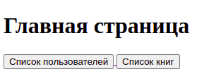
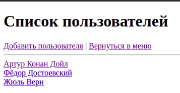
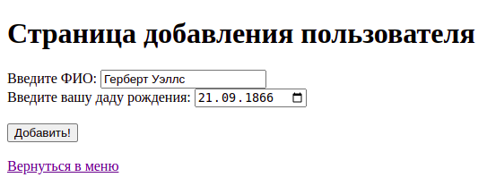
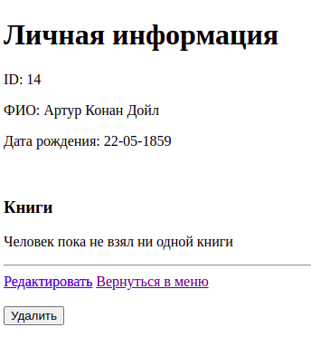
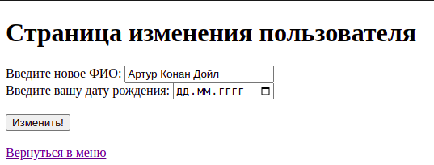
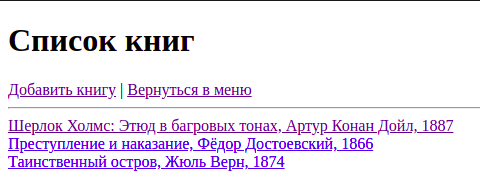
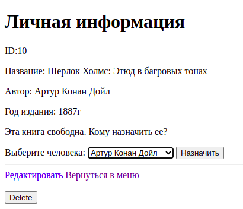
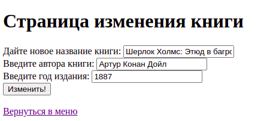
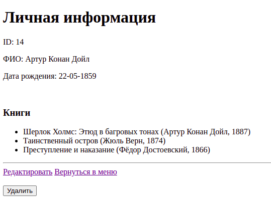
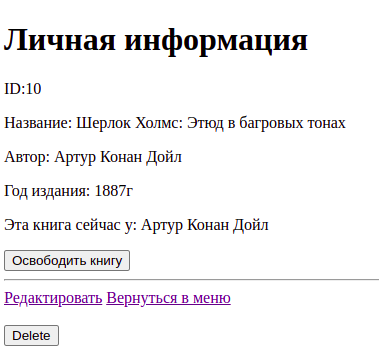

# 📚 Библиотека
– реализовать веб-приложение для цифрового учета книг в библиотеке.

## 🎯 Задача
В местной библиотеке хотят перейти на цифровой учет книг. Вам необходимо создать веб-приложение, которое позволит библиотекарям:
- 📌 Регистрировать читателей.
- 📌 Выдавать книги читателям.
- 📌 Освобождать книги (когда читатель возвращает книгу обратно в библиотеку).

---

## 🔥 Необходимый функционал

### **👥 Читатели (Пользователи)**
✔️ Страницы:
- **Добавление, редактирование, удаление читателя.**
- **Список всех читателей** (каждый читатель кликабельный, переход на его страницу).
- **Страница читателя** с:
    - Личными данными.
    - Списком книг, которые он взял.
    - Если читатель не взял книг → показывается сообщение _"Человек пока не взял ни одной книги"_.

### **📖 Книги**
✔️ Страницы:
- **Добавление, редактирование, удаление книги.**
- **Список всех книг** (каждая книга кликабельная, переход на её страницу).
- **Страница книги** с:
    - Названием, автором, годом выпуска.
    - Если книгу взял читатель → показывается **его имя** и кнопка _"Освободить книгу"_.
    - Если книга свободна → отображается **выпадающий список** со всеми читателями и кнопка _"Назначить книгу"_.


## 🚀 Как запустить проект

### 1️⃣ **Клонировать репозиторий**
```bash
git clone https://github.com/0-Luntik-0/project1.git
cd ВАШ-ПРОЕКТ
```

### 2️⃣ **Настроить базу данных**
1. Открыть PostgreSQL и создать базу данных:
```sql
CREATE DATABASE library;
CREATE TABLE person (
    id_person GENERATED ALWAYS AS IDENTITY PRIMARY KEY,
    fio VARCHAR(255) NOT NULL,
    year_of_birth DATE
);

CREATE TABLE book (
    id_book GENERATED ALWAYS AS IDENTITY PRIMARY KEY,
    id_person INTEGER,
    name VARCHAR(200) NOT NULL,
    author VARCHAR(100) NOT NULL,
    year INTEGER,
    borrow_date TIMESTAMP,
    CONSTRAINT fk_book_person FOREIGN KEY (id_person) REFERENCES person(id_person) ON DELETE SET NULL
);

```
2. **Переименовать файл конфигурации**  
   В каталоге **`src/main/resources/`** найдите файл:
   ```
   application.properties.origin
   ```
   Переименуйте его в:
   ```
   application.properties
   ```

3. **Открыть `application.properties` и указать свои данные**  
   Откройте файл `application.properties` и добавьте:
   ```properties
   # Настройки подключения к базе данных PostgreSQL
   driverDB=org.postgresql.Driver
   urlDB=jdbc:postgresql://localhost:5432/library
   usernameDB=ВАШ_ЮЗЕР
   passwordDB=ВАШ_ПАРОЛЬ
   ```
   🔹 **ВАЖНО:** Укажите **свои данные** вместо `ВАШ_ЮЗЕР` и `ВАШ_ПАРОЛЬ`.

### 3️⃣ **Собрать и запустить проект**
```bash
mvn clean package
mvn spring-boot:run
```

### 4️⃣ **Открыть в браузере**
Перейдите по адресу:  
🔗 `http://localhost:8080/`

---

## 🏆 Скриншоты






















